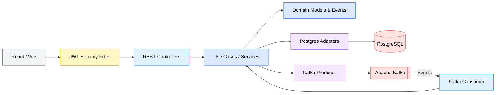
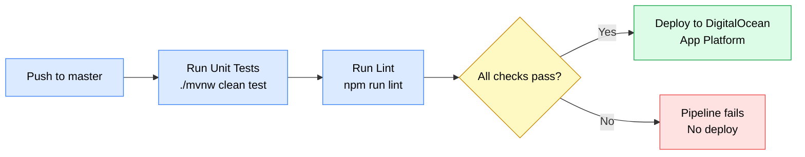

<a id="readme-top"></a>

<!-- PROJECT SHIELDS -->
[![Contributors][contributors-shield]][contributors-url]
[![Forks][forks-shield]][forks-url]
[![Stargazers][stars-shield]][stars-url]
[![Issues][issues-shield]][issues-url]
[![LinkedIn][linkedin-shield]][linkedin-url]

<!-- PROJECT LOGO -->
<br />
<div align="center">
  <a href="https://github.com/leonifrazao/MoraNode">
    
  </a>

  <h3 align="center">MoraNode Engine</h3>

  <p align="center">
    Real Estate Management System built with Hexagonal Architecture, Event-Driven messaging via Kafka, JWT Authentication, and a Dark Mode interface with Glassmorphism.
    <br />
    <a href="https://github.com/leonifrazao/MoraNode"><strong>Explore the docs</strong></a>
    <br />
    <br />
    <a href="https://github.com/leonifrazao/MoraNode/issues/new?labels=bug">Report Bug</a>
    &middot;
    <a href="https://github.com/leonifrazao/MoraNode/issues/new?labels=enhancement">Request Feature</a>
  </p>
</div>

<!-- TABLE OF CONTENTS -->
<details>
  <summary>Table of Contents</summary>
  <ol>
    <li>
      <a href="#about-the-project">About The Project</a>
      <ul>
        <li><a href="#architecture">Architecture</a></li>
        <li><a href="#built-with">Built With</a></li>
      </ul>
    </li>
    <li>
      <a href="#features">Features</a>
    </li>
    <li>
      <a href="#getting-started">Getting Started</a>
      <ul>
        <li><a href="#prerequisites">Prerequisites</a></li>
        <li><a href="#running-with-docker-full-stack">Running with Docker (Full Stack)</a></li>
        <li><a href="#running-locally-for-development">Running Locally (For Development)</a></li>
        <li><a href="#deploying-to-digitalocean">Deploying to DigitalOcean</a></li>
      </ul>
    </li>
    <li><a href="#cicd-pipeline">CI/CD Pipeline</a></li>
    <li><a href="#project-structure">Project Structure</a></li>
    <li><a href="#tests">Tests</a></li>
    <li><a href="#api-endpoints">API Endpoints</a></li>
    <li><a href="#roadmap">Roadmap</a></li>
    <li><a href="#contributing">Contributing</a></li>
    <li><a href="#contact">Contact</a></li>
  </ol>
</details>

<!-- ABOUT THE PROJECT -->
## About The Project

MoraNode Engine is a comprehensive real estate management system designed to handle properties and their rental or sales contracts. The backend was built by rigorously applying **Hexagonal Architecture (Ports & Adapters)**, ensuring the business domain is completely independent of frameworks, databases, or messaging systems.

Data consistency between Properties and Contracts is maintained in an **event-driven** fashion: when a contract is created or has its status changed, events are published to Apache Kafka. An internal consumer processes these events and automatically updates the linked property's availability, without any direct coupling between use cases.

Access to the API is protected by **JWT (JSON Web Token)** authentication via Spring Security. All endpoints require a valid Bearer token, issued upon login.

The frontend is a SPA built with React 19 and Vite, served in production via Nginx with a reverse proxy to the API. The entire stack (backend, frontend, database, kafka) boots up with a single `docker-compose up` command. The application is **hosted on DigitalOcean App Platform** with a fully automated **CI/CD pipeline** — every push to `master` triggers tests, lint, and an automatic deployment.

### Screenshots

<details>
  <summary>Dashboard</summary>
  <br />
  
</details>

<details>
  <summary>Property Management</summary>
  <br />
  
</details>

<details>
  <summary>Contract Management</summary>
  <br />
  
</details>

<details>
  <summary>New Property Modal</summary>
  <br />
  
</details>

<p align="right">(<a href="#readme-top">back to top</a>)</p>

### Architecture

The backend follows Hexagonal Architecture. The central domain (Use Cases, Models, Events) is fully isolated. Driving adapters (REST Controllers, Kafka Consumer) and driven adapters (Postgres Adapters, Kafka Producer) connect the domain to the outside world through interfaces (Ports). A JWT Security Filter sits at the edge of the application, intercepting all incoming requests before they reach the controllers.



<p align="right">(<a href="#readme-top">back to top</a>)</p>

### Built With

**Backend**
* [![Spring Boot][Spring.boot]][Spring-url] &mdash; Java 21, Spring Boot 4.0.3 (REST API, Data JPA, Validation)
* [![Spring Security][SpringSecurity]][SpringSecurity-url] &mdash; JWT Authentication with Bearer tokens
* [![Kafka][Kafka.apache.org]][Kafka-url] &mdash; Confluent 7.4.0 (Async Event Streaming)
* [![PostgreSQL][PostgreSQL.org]][PostgreSQL-url] &mdash; PostgreSQL 15 (Relational Persistence)

**Frontend**
* [![React][React.js]][React-url] &mdash; React 19 with react-router-dom (SPA)
* [![Vite][Vite.js]][Vite-url] &mdash; Vite 6 (Build tooling)
* [![TypeScript][TypeScript.org]][TypeScript-url] &mdash; Strict typing mirroring Java DTOs
* [![TailwindCSS][TailwindCSS.com]][TailwindCSS-url] &mdash; Styling with Dark Mode and Glassmorphism
* [![Shadcn/UI][Shadcn.ui]][Shadcn-url] + [![Radix UI][Radix.ui]][Radix-url] &mdash; Component library
* **Lucide React** &mdash; Icons
* **Axios** &mdash; HTTP client (with JWT interceptor for automatic token injection)

**Infrastructure & DevOps**
* [![DigitalOcean][DigitalOcean]][DigitalOcean-url] &mdash; App Platform (Production Hosting)
* [![Docker][Docker.com]][Docker-url] &mdash; Multi-stage builds (Maven + Bun + Nginx)
* [![GitHub Actions][GHActions]][GHActions-url] &mdash; CI/CD pipeline (test → lint → deploy)
* **Kafdrop** &mdash; Kafka topics monitoring UI

<p align="right">(<a href="#readme-top">back to top</a>)</p>

## Features

**Authentication**
- JWT-based login endpoint (`/auth/login`) returning a signed Bearer token
- Spring Security filter chain protecting all API routes
- Axios interceptor on the frontend automatically attaches the token to every request
- Token stored in `localStorage` and cleared on logout

**Property Management**
- Table listing with availability status (visual badges)
- Registration via modal with validation
- Editing blocked when an active contract is linked
- Physical deletion with active contract verification
- Availability automatically updated via Kafka events

**Contract Management**
- Listing with color-coded status badges (ACTIVE, FINISHED, CANCELED, IN_DISPUTE)
- Contract creation linked to existing properties
- Cancellation and finalization via logical status change (PATCH)
- Business rule validation (dates, values, property availability)
- Automatic renewal only for active rental contracts

**Interface**
- Native Dark Mode with consistent theming
- Glassmorphism (backdrop-blur) on cards and containers
- Dashboard with computed metrics (revenue, occupancy rate, average ticket, total area)
- Portfolio occupancy progress bar
- Loading states with Skeletons
- Standardized empty states with icons and clear messages
- Fixed sidebar navigation

**Architecture and Infrastructure**
- Hexagonal Architecture with IN Ports (6 use cases) and OUT Ports (3 interfaces)
- Kafka Events: `imovel-ocupado-topic` and `imovel-desocupado-topic`
- JWT authentication with Spring Security (stateless session management)
- CORS configured in Spring Boot to accept frontend requests
- Nginx as reverse proxy in production (`/api/` proxied to `app:8080`)
- Docker Compose orchestrating 6 services on a single network (`moranode-network`)
- Healthchecks configured for PostgreSQL and Kafka
- Hosted on DigitalOcean App Platform with automated CI/CD via GitHub Actions

<p align="right">(<a href="#readme-top">back to top</a>)</p>

<!-- GETTING STARTED -->
## Getting Started

### Prerequisites

* [Docker](https://docker.com) and Docker Compose
* For local development: Java 21+, Maven, Node.js 18+

### Running with Docker (Full Stack)

A single command boots up the entire infrastructure (PostgreSQL, Zookeeper, Kafka, Kafdrop, Backend and Frontend):

1. Clone the repository
   ```sh
   git clone https://github.com/leonifrazao/MoraNode.git
   cd MoraNode
   ```
2. Set environment variables in `.env` (default values already included)
   ```env
   DB_PASSWORD=password
   DB_USER=postgres
   DB_NAME=moranode_db
   JWT_SECRET=your_jwt_secret_key_here
   ```
3. Spin up the entire stack
   ```sh
   docker-compose up -d
   ```
4. Access the application

   | Service   | URL                        |
   |-----------|----------------------------|
   | Frontend  | http://localhost:3000       |
   | API       | http://localhost:8080       |
   | Kafdrop   | http://localhost:9000       |

### Running Locally (For Development)

1. Start only the infrastructure services (database, kafka, etc.)
   ```sh
   docker-compose up -d db zookeeper kafka kafdrop
   ```

2. Export the required environment variables
   ```sh
   export SPRING_DATASOURCE_PASSWORD=password
   export JWT_SECRET=your_jwt_secret_key_here
   ```

3. Start the Spring Boot backend
   ```sh
   ./mvnw spring-boot:run
   ```

4. In another terminal, start the frontend (port 5173 in dev mode)
   ```sh
   cd web
   npm install
   npm run dev
   ```

### Deploying to DigitalOcean (with Supabase PostgreSQL)

The application is hosted on **DigitalOcean App Platform**. Deployments are triggered automatically via the CI/CD pipeline on every push to `master`. For manual setup, configure the following environment variables in the App Platform settings:

| Variable | Example Value |
|---|---|
| `SPRING_DATASOURCE_URL` | `jdbc:postgresql://db.<project-ref>.supabase.co:5432/postgres?sslmode=require` |
| `SPRING_DATASOURCE_USERNAME` | `postgres` |
| `SPRING_DATASOURCE_PASSWORD` | `your_supabase_password` |
| `SPRING_KAFKA_BOOTSTRAP_SERVERS` | `your-kafka-broker:9092` |
| `JWT_SECRET` | `your_jwt_secret_key_here` |

> **Note:** Never commit credentials to the repository. Set all sensitive values exclusively through the DigitalOcean App Platform environment variable settings or GitHub Actions secrets.

<p align="right">(<a href="#readme-top">back to top</a>)</p>

---

## CI/CD Pipeline

Every push to the `master` branch triggers a fully automated pipeline via **GitHub Actions**.



### Pipeline Steps

| Step | Tool | Description |
|---|---|---|
| **Unit Tests** | Maven (`./mvnw clean test`) | Runs all 45 unit tests against domain models and use case services |
| **Lint** | ESLint (`npm run lint`) | Validates TypeScript/React code quality in the frontend |
| **Deploy** | DigitalOcean App Platform | Triggers a new deployment only if both previous steps succeed |

### Secrets Required (GitHub Actions)

Configure these in your repository's **Settings → Secrets and variables → Actions**:

| Secret | Description |
|---|---|
| `DIGITALOCEAN_ACCESS_TOKEN` | DigitalOcean personal access token |
| `DIGITALOCEAN_APP_ID` | The App Platform app ID to trigger deploys on |

<p align="right">(<a href="#readme-top">back to top</a>)</p>

---

## Project Structure

```
MoraNode/
  ├── .github/
  │   └── workflows/
  │       └── ci-cd.yml       # GitHub Actions pipeline (test → lint → deploy)
  ├── src/main/java/com/leonifrazao/MoraNode/
  │   ├── domain/
  │   │   ├── model/          # ImovelDomain, ContratoDomain, Enums, Events
  │   │   ├── port/in/        # Use Case interfaces (6 ports)
  │   │   ├── port/out/       # Repository & Notification interfaces (3 ports)
  │   │   └── usecase/        # Service implementations
  │   └── infrastructure/
  │       ├── adapter/web/    # REST Controllers (Imovel, Contrato, Auth)
  │       ├── adapter/in/     # Kafka Consumer
  │       ├── adapter/out/    # Postgres Adapters, Kafka Producer
  │       ├── database/       # JPA Entities, Spring Data Repositories
  │       ├── mappers/        # Domain <-> Entity mappers
  │       ├── config/         # Bean wiring, Spring Security, JWT config
  │       ├── security/       # JwtUtil, JwtFilter, UserDetailsService
  │       └── exceptions/     # Global handler, custom exceptions
  ├── web/
  │   ├── src/
  │   │   ├── pages/          # Dashboard, Imoveis, Contratos, Login
  │   │   ├── components/     # Modals, UI (Shadcn), Layout
  │   │   ├── services/       # Axios API config (with JWT interceptor)
  │   │   ├── types/          # TypeScript interfaces mirroring Java DTOs
  │   │   └── hooks/          # Custom hooks (toast, feedback, auth)
  │   ├── dockerfile          # Bun build + Nginx
  │   └── nginx.conf          # SPA routing + reverse proxy /api/
  ├── docker-compose.yml      # 6 services, 1 network
  ├── Dockerfile              # Maven multi-stage build (Java 21)
  └── .env                    # Database credentials (never commit secrets)
```

<p align="right">(<a href="#readme-top">back to top</a>)</p>

## Tests

The project includes **45 unit tests** covering domain models and use case services. Tests follow the hexagonal architecture pattern — use case services are tested with mocked ports, and domain models are tested directly without any mocks. These tests run automatically on every push to `master` as part of the CI/CD pipeline.

| Test Class | Layer | Tests |
|---|---|---|
| `CadastrarContratoServiceTest` | Use Case | 8 |
| `CadastrarImovelServiceTest` | Use Case | 6 |
| `BuscaContratoServiceTest` | Use Case | 4 |
| `BuscaImovelServiceTest` | Use Case | 3 |
| `DeletaImovelServiceTest` | Use Case | 2 |
| `ValidaEstadoContratoServiceTest` | Use Case | 2 |
| `ContratoDomainTest` | Domain Model | 10 |
| `ImovelDomainTest` | Domain Model | 9 |

Run the tests locally:
```sh
./mvnw clean test
```

<p align="right">(<a href="#readme-top">back to top</a>)</p>

## API Endpoints

### Authentication `/auth`

| Method | Path | Description |
|--------|------|-------------|
| `POST` | `/auth/login` | Authenticate and receive a JWT Bearer token |

> All other endpoints require an `Authorization: Bearer <token>` header.

### Properties `/imoveis`

| Method   | Path           | Description                    |
|----------|----------------|--------------------------------|
| `GET`    | `/imoveis`     | List all properties            |
| `GET`    | `/imoveis/{id}`| Get property by ID             |
| `POST`   | `/imoveis`     | Register new property          |
| `PUT`    | `/imoveis/{id}`| Edit property by ID            |
| `DELETE` | `/imoveis/{id}`| Delete property by ID          |

### Contracts `/contratos`

| Method   | Path                      | Description                     |
|----------|---------------------------|---------------------------------|
| `GET`    | `/contratos`              | List all contracts              |
| `GET`    | `/contratos/{id}`         | Get contract by ID              |
| `POST`   | `/contratos`              | Register new contract           |
| `PATCH`  | `/contratos/{id}/status`  | Update contract status          |

<p align="right">(<a href="#readme-top">back to top</a>)</p>

## Roadmap

- [x] Domain modeled with Hexagonal Architecture (Ports & Adapters)
- [x] Full CRUD for Properties with domain validation
- [x] Contract management with business rules (edit blocking, renewal)
- [x] Kafka Producer/Consumer for occupancy/vacancy events
- [x] React 19 + Vite frontend with Dark Mode and Glassmorphism
- [x] Dashboard with real-time computed metrics
- [x] Full-stack Docker Compose (6 services)
- [x] Nginx reverse proxy with static asset caching
- [x] Unit tests (45 tests — domain models + use case services)
- [x] JWT Authentication with Spring Security
- [x] Hosted on DigitalOcean App Platform
- [x] CI/CD pipeline with GitHub Actions (test → lint → deploy on master)
- [ ] Redis caching for property listing endpoints
- [ ] Clients page
- [ ] Role-based authorization (admin vs. viewer)

<p align="right">(<a href="#readme-top">back to top</a>)</p>

## Contributing

Contributions are what make the open source community such an amazing place to learn, inspire, and create. Any contributions you make are **greatly appreciated**.

1. Fork the Project
2. Create your Feature Branch (`git checkout -b feature/AmazingFeature`)
3. Commit your Changes (`git commit -m 'Add some AmazingFeature'`)
4. Push to the Branch (`git push origin feature/AmazingFeature`)
5. Open a Pull Request

<p align="right">(<a href="#readme-top">back to top</a>)</p>

## Contact

leonifrazao - Project Link: [https://github.com/leonifrazao/MoraNode](https://github.com/leonifrazao/MoraNode)

<p align="right">(<a href="#readme-top">back to top</a>)</p>

<!-- MARKDOWN LINKS & IMAGES -->
[contributors-shield]: https://img.shields.io/github/contributors/leonifrazao/MoraNode.svg?style=for-the-badge
[contributors-url]: https://github.com/leonifrazao/MoraNode/graphs/contributors
[forks-shield]: https://img.shields.io/github/forks/leonifrazao/MoraNode.svg?style=for-the-badge
[forks-url]: https://github.com/leonifrazao/MoraNode/network/members
[stars-shield]: https://img.shields.io/github/stars/leonifrazao/MoraNode.svg?style=for-the-badge
[stars-url]: https://github.com/leonifrazao/MoraNode/stargazers
[issues-shield]: https://img.shields.io/github/issues/leonifrazao/MoraNode.svg?style=for-the-badge
[issues-url]: https://github.com/leonifrazao/MoraNode/issues
[linkedin-shield]: https://img.shields.io/badge/-LinkedIn-black.svg?style=for-the-badge&logo=linkedin&colorB=555
[linkedin-url]: https://linkedin.com/in/othneildrew

[React.js]: https://img.shields.io/badge/React_19-20232A?style=for-the-badge&logo=react&logoColor=61DAFB
[React-url]: https://react.dev/
[Spring.boot]: https://img.shields.io/badge/Spring_Boot_4-6DB33F?style=for-the-badge&logo=spring-boot&logoColor=white
[Spring-url]: https://spring.io/projects/spring-boot
[SpringSecurity]: https://img.shields.io/badge/Spring_Security-6DB33F?style=for-the-badge&logo=springsecurity&logoColor=white
[SpringSecurity-url]: https://spring.io/projects/spring-security
[Vite.js]: https://img.shields.io/badge/Vite_6-%23646CFF.svg?style=for-the-badge&logo=vite&logoColor=white
[Vite-url]: https://vitejs.dev/
[PostgreSQL.org]: https://img.shields.io/badge/PostgreSQL_15-4169e1?style=for-the-badge&logo=postgresql&logoColor=white
[PostgreSQL-url]: https://www.postgresql.org/
[Kafka.apache.org]: https://img.shields.io/badge/Apache_Kafka-231F20?style=for-the-badge&logo=apachekafka&logoColor=white
[Kafka-url]: https://kafka.apache.org/
[TailwindCSS.com]: https://img.shields.io/badge/Tailwind_CSS-%2338B2AC.svg?style=for-the-badge&logo=tailwind-css&logoColor=white
[TailwindCSS-url]: https://tailwindcss.com/
[Docker.com]: https://img.shields.io/badge/Docker-2496ED?style=for-the-badge&logo=docker&logoColor=white
[Docker-url]: https://docker.com/
[TypeScript.org]: https://img.shields.io/badge/TypeScript-3178C6?style=for-the-badge&logo=TypeScript&logoColor=FFF
[TypeScript-url]: https://www.typescriptlang.org/
[Shadcn.ui]: https://img.shields.io/badge/shadcn%2Fui-000?style=for-the-badge&logo=shadcnui&logoColor=fff
[Shadcn-url]: https://ui.shadcn.com/
[Radix.ui]: https://img.shields.io/badge/Radix_UI-161618?style=for-the-badge&logo=radixui&logoColor=white
[Radix-url]: https://www.radix-ui.com/
[DigitalOcean]: https://img.shields.io/badge/DigitalOcean-0080FF?style=for-the-badge&logo=digitalocean&logoColor=white
[DigitalOcean-url]: https://www.digitalocean.com/
[GHActions]: https://img.shields.io/badge/GitHub_Actions-2088FF?style=for-the-badge&logo=githubactions&logoColor=white
[GHActions-url]: https://github.com/features/actions
